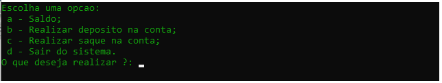
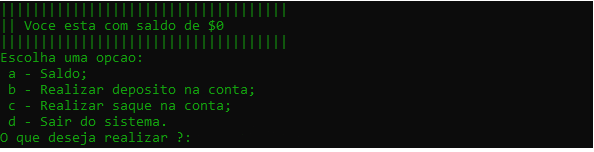
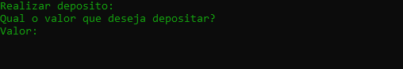
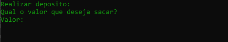

<h1 align="center">
  Sistema simples de uma conta bancária
</h1>

O presente projeto destina-se a disponibilizar um pequeno sistema SIMPLES de uma conta bancária. O projeto possui funcionalidades simples que qualquer tipos de conta em qualquer banco possui, como por exemplo: 

<ul>
  <li>
    Saber o saldo
  </li>
  <li>
    Ralizar deposito
  </li>
  <li>
    Realizar saque
  </li>
  <li>
    Sair da conta
  </li>
</ul>

<h2 align="center">Desenvolvedor:</h2>
<table align="center">
  <tr>
    <td align="center">
      Lucas Silva &logo=<LOGO>">
    </td>
    
  </tr>
</table>

<h1>Sobre a Aplicação(DEV):</h1>

A aplicação não possui um leyout como um software de computador concluito. Ou seja, a aplicação realiza suas funcionalidades por meio do prompt de comando(cmd). Tal possui uma telas simples com as opções a serem escolhidas:

<h1 align="center">
  
</h1>

Como também possui as subfunções que podem ser realizadas após escolher as opções primárias. Como por exemplo:

<ol>
  <li>
    
Ver saldo da conta:

    <h1 align="center">
     
    </h1>
  </li>
   <li>
    
Realizar deposito:

    <h1 align="center">
     
    </h1>
  </li>
  <li>
    
Realizar saque:

    <h1 align="center">
     
    </h1>
  </li>
</ol>

